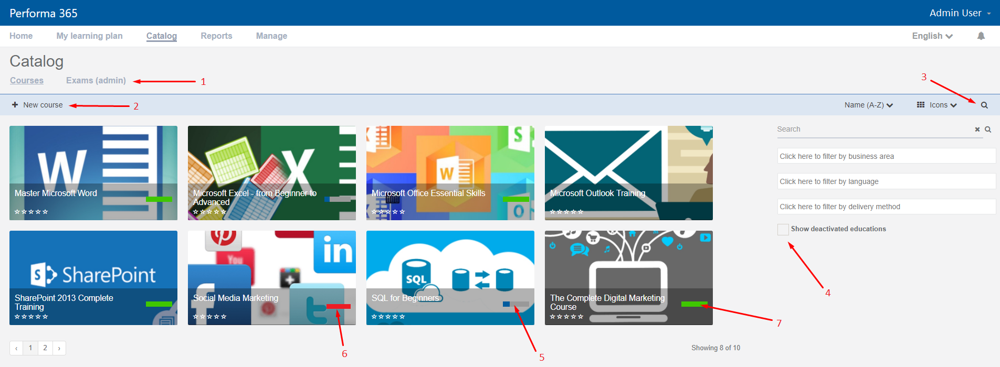

.. _catalog:

Use the Catalog
================

All application roles can browse the catalog however some additional, management features are only enabled to users with a specific role, as described below.

About
******

.. 

**Catalog** shows all types of learning content currently available in the system. Currently, catalog shows *Courses* and *Exams* which are both listed in the submenu of the **Catalog** page. *Exams* (1) are only visible to exam administrators and exam creators. 

.. 

The **Ribbon** below the catalog menu contains action button *New course* (2) only visible to catalog administrators. The right side of the ribbon has icons for sorting and displaying the results as well as the magnifying glass icon (3) which opens and closes the panel with search and filtering options. *Show deactivated educations* checkbox (4) on this panel is only visible to catalog administrator. 

.. _courses:

Courses
**********

When selected from the submenu, the **Courses** page is displayed to the user showing courses depending on user's application role and course's visibility property. There are three types of visibility:

* **Public and self-enroll** - all users can see the course in the catalog and self-enroll to the course.
* **View only** - all users can see the course in the catalog but cannot self-enroll to the course.
* **Enrolled learners and owners only** - only enrolled users, course owners and catalog administrators can see the course in the catalog. If the current user is instructor in at least one course schedule, they will also be able to see the course.

Each course tile contains name, image and learner status displayed by the progress bar:

* Progress bar can be blue (5) which indicates that learner is currenty enrolled to the course and is not behind schedule. There is no due date for self-enrollment. 
* Red progress bar (6) indicates that learner enrolled to the course is behind schedule. This does not apply to self-enrolled courses.
* Green progress bar (7) indicates that the learner has completed the course.

**Creating a New Course**

Only catalog administrators are able to create new courses by clicking on action button *New course*. 

To learn more go to :ref:`How to > Work With Courses<courses>`.

Exams
**********

To learn more about exams, go to :ref:`How to > Work With Exams<exams>`.
